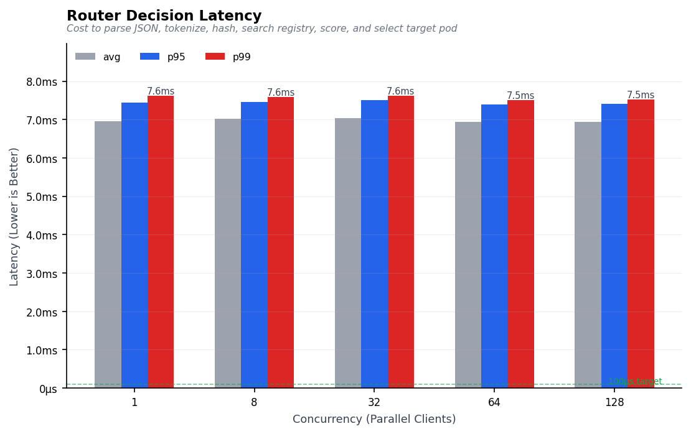
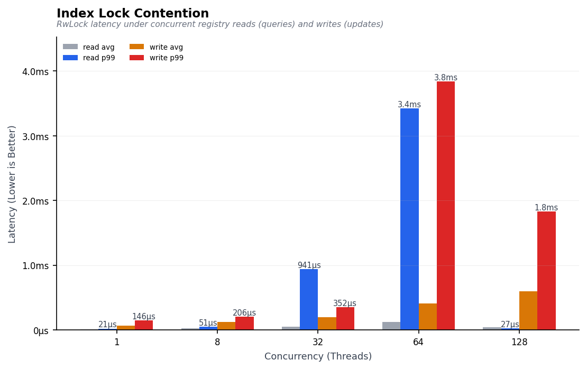
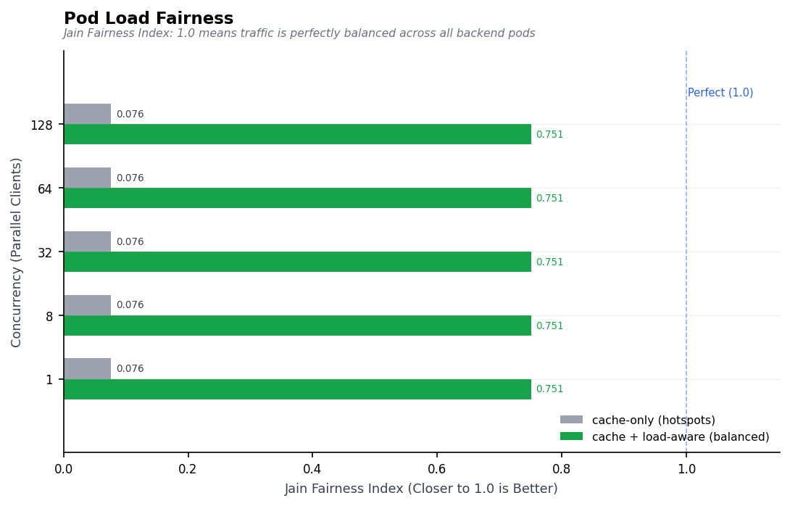
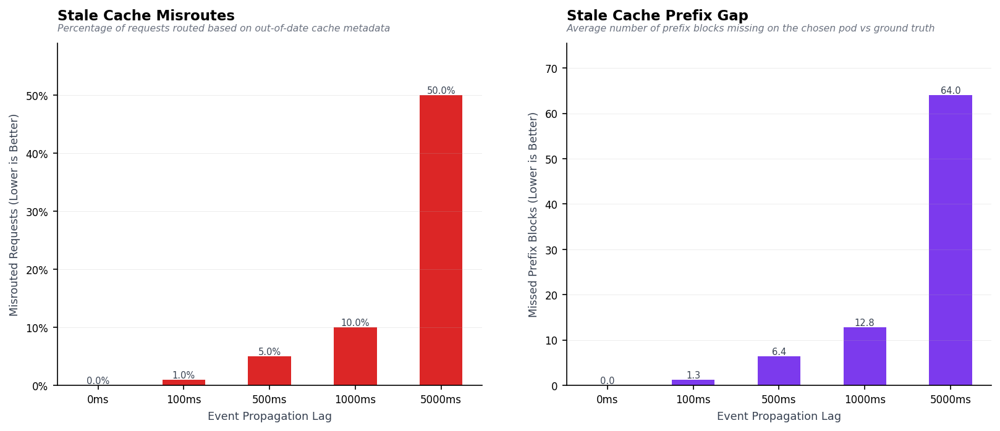

# Calinix Policy Benchmarks

this is the benchmark results on cach aware router for single and disaggregated dispatch modes

Here is the progress and findings:

---

## 1. Decision Latency & Scalability

Measures the overhead of the entire routing decision loop (JSON parsing, tokenization, hashing, registry prefix query, scoring, and pod selection) across concurrencies.

Latency remains stable at **~7.0 ms** however our goal is to achieve < 1 ms we keep balling here

## 2. Sharded Index Lock Contention

Stresses the 256-shard RwLock registry index with concurrent read queries (readers) and cache event updates (writers).

- **Result**: Read queries stay under **40 µs** and writes stay under **600 µs** even at 128 threads, showing that sharding keeps lock contention negligible.

---

## 3. Cluster Load Fairness

Compares pure cache-affinity routing against load-aware cache routing.

- **Jain Fairness Index**:
  - **Cache-only routing**: `0.076` (causes severe pod hotspotting for shared prefixes).
  - **Cache + Load-aware routing**: `0.751` (successfully balances load across the cluster while preserving cache matching).

---

## 4. Cache Staleness Sensitivity

Measures how network propagation lag of backend cache events back to the router index degrades matching accuracy.

- **Result**: A lag of **1s** results in a **10% misroute rate** and a **12.8-block cache gap**. This quantifies the exact latency budget allowed for real-time cache sync events.
