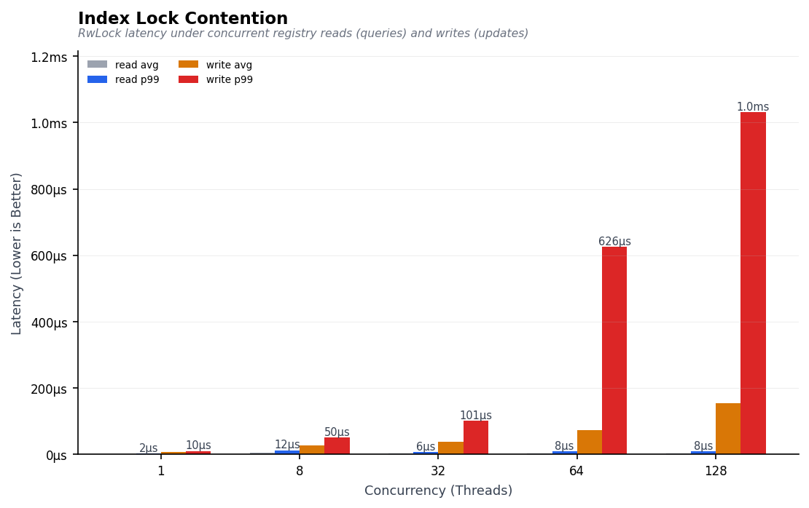
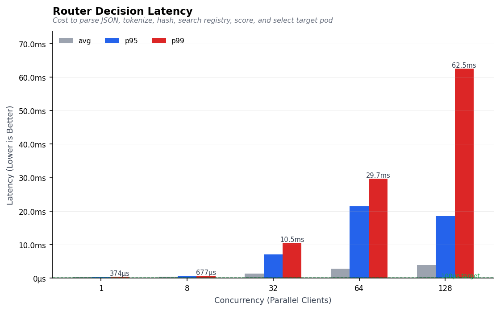
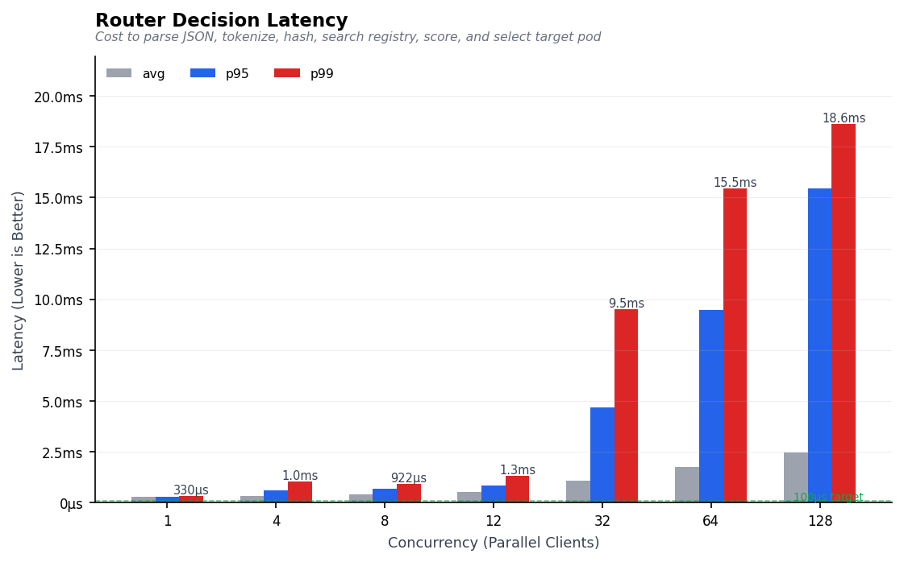

# Calinix Router Latency Optimization Journey

We set out to build a high-performance, cache-aware router, aiming for a routing decision latency of **< 1 ms** under high concurrency. This page documents our engineering journey, showing how we identified bottlenecks, iterated on the code, and eventually optimized the hot path.

---

## Iteration 1: The Initial Baseline (`policy-bench`)

Our first implementation of the 4-stage routing pipeline (Prepare -> Filter -> Score -> Pick) was fully functional, but it didn't scale.

Under a single thread, routing a request took about **28 µs**. However, as soon as we introduced concurrent traffic, latency rapidly degraded. At 128 concurrency, the routing decision took an average of **~7–8 ms**—introducing a significant and unacceptable overhead on the hot path.

## Iteration 2: Locking and Sharding Tweaks (`policy-bench-v2`)

In the second iteration, we focused on index contention. We sharded the block index registry into 256 independent hash maps and introduced Fibonacci hashing using the Golden Ratio multiplier (`0x9E37_79B9_7F4A_7C15`) to distribute hashes uniformly and avoid lock hotspots.

Lock contention was successfully eliminated (read queries stayed under **40 µs** and writes under **600 µs**), but routing latency under high concurrency was still hovering around **3.5 ms**.

While we fixed the lock synchronization bottleneck, we hadn't addressed the memory allocation bottleneck. The CPU was still spending most of its time allocating and deallocating memory on the hot routing path for every single request.

---

## Iteration 3: Zero-Allocation Hot Path (`new-policy-v3`)

To finally smash the 1ms target, we went through the hot path and eliminated all dynamic heap allocations.

* **The Optimizations:**
  1. **Zero-Allocation JSON Parsing:** We switched to deserializing requests into a flat, strongly-typed DTO (`OpenAiRequestDto`) borrowing string slices directly from the incoming request buffer, eliminating JSON tree heap allocations.
  2. **Stack-Allocated Bitmaps:** We replaced `Vec<u64>` with a stack-allocated, fixed-size 256-bit bitmap structure (`HostBitmap` implemented as `[u64; 4]`), which reduced p99 bitmap operations by ~5.8x.
  3. **Single-Pass Cumulative Hash Streaming:** We rewrote the token block splitting and FNV-1a cumulative chain generation into a single streaming loop, eliminating intermediate vector allocations.

* **The Results (from `new-policy-v3/policy_bench.csv` using 1,000 requests per concurrency level):**
  * **1 Concurrency:** Average latency of **273 µs** (with p50 at 268 µs).
  * **12 Concurrency:** Average latency of **534 µs** (well under our 1ms target).
  * **128 Concurrency:** Average latency of **2.45 ms** (with p50 at **454 µs**).

By eliminating dynamic allocations on the hot path, we successfully reduced routing latency to a fraction of a millisecond for typical concurrent loads.
